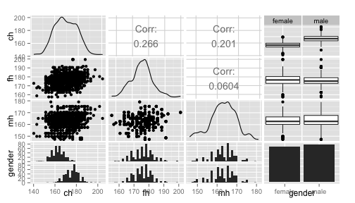

PredictHeight
========================================================
author: Michael Lee
date: October 18, 2015
transition: linear

Why Predict A Child's Height???
========================================================

- Parents often wonder how tall their toddler or preschooler might be when they grow up. Gradeschoolers and young teens may ask, "How tall will I be?" 
- It is fun to try and predict.
- The dataset `GaltonFamilies` in the [HistData](https://cran.r-project.org/web/packages/HistData/) R package was used to create a predictive model.
- The model predicts the child's height using the father's height, the mother's height, and the child's gender.

Predictive Model
========================================================

 

From the data, the child's height is reasonably correlated with the father's height and the mother's height. The child's gender also appears to be a significant factors. As a result, the above factors were used to build the linear regression model.

Using The PredictHeight App
========================================================

Use the slider bars and radio buttons to specify the followings:
- Father's Height
- Mother's Height
- Child's Gender

About
========================================================

- Try the [PredictHeight Shiny App](https://michaellee.shinyapps.io/PredictHeight)
- Access the [Source Code at GitHub](https://github.com/michael-lee/DDP_Project)
